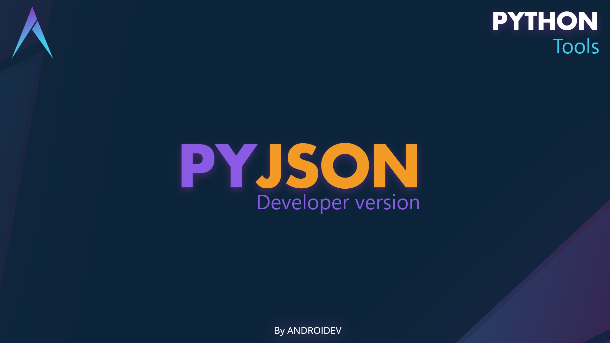

# jsonPy 

It's a python tool to organize the json files in your project, with which you can add, edit, find and delete the data in your custom json files. In there will create a folder with the data that you can interact with.

## First things first

When you import the component, it creates a folder 'data' to save the resources of your code, and there you are, now can add your first value or dictionary in Json file as you like.

## Model of data in our Json
we define the data in Json file  like...

```
	#IN CURRJSON.JSON :
	{
		"field":[
            {
                "item":"value"
                "ID":"KJ4K65J"
            },
            {
                "item2":"value2"
                "ID":"5UIFKD9E"
            }
		],
		"field2":[
            {
                "item":"value"
                "ID":"IUTQ34GR"
            }	
	}
```

## Recommended Usage

In your code, we recommend you to define a particular Json file by string value, which  you can use to declare the current file that you want work with.

	currJson = 'nameDefault' # could be by name 
	currJson = 'nameDefault.json' # or could be by file name as well
	#addItem( currJson...
We crated a dictionary parameter, that must to contain the name of field in a particular json file , to organize the internal data. 

	fielDefault = 'dicDefault'
	#addItem( currJson, fieldDefault ...